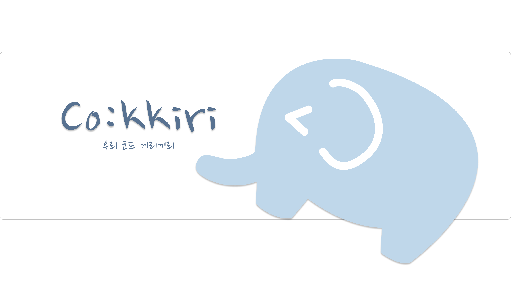

# 🐘 Co:kkiri - 코:끼리, 함께 코딩해 즐거운 화상 채팅 서비스



> [CO:KKIRI Notion](https://skitter-dogsled-8c1.notion.site/402cd5fd77484712a0f0632a7dab6b52)

> [UCC](https://www.youtube.com/watch?v=LcW992gTHkE)

## 프로젝트 개요

## 🟦 Project

### 1. 프로젝트 기간

- SSAFY 7기 2학기 공통 프로젝트 웹기술 트랙
- **진행 기간** : 2022. 07. 05. ~ 2022. 08. 19.

<br>

### 2. 프로젝트 소개

**👩‍💻 *우리 코드 끼리끼리* 👨‍💻**

- **프로젝트 명**: **Co:kkiri**
    - 코드 끼리끼리
        - Co : 코드 + 함께 한다는 의미의 영어 접두사
        - kkiri: 함께 한다는 의미의 한국어 접미사
        - 코끼리는 개발자끼리 함께 모여 즐겁게 코딩을 하자는 의미에서 개발되었습니다.
    - 개발자, 혹은 예비 개발자를 위해 코딩에 특화된 실시간 커뮤니케이션 화상 채팅 플랫폼입니다.
- **프로젝트 기획 배경**
    - 코로나로 비대면 서비스의 필요성이 대두되었고, 이러한 흐름은 개발자도 피해 갈 수 없었습니다.
    - 스터디 플랫폼도 많고 화상 채팅 프로그램도 많은데 왜 이러한 프로그램을 만드는 개발자들을 위한 화상 플랫폼은 없는지 한 번쯤 생각해 보지 않았나요?
    - 없다면 직접 있었으면 하는 기능을 모아 만드는 게 바로 개발자 덕목이죠! 코끼리는 개발자로서 여러 화상 프로그램을 이용하며 느낀 필요한 기능을 넣고 불편한 점은 뺐답니다!

<br>

### 3. Project 주요 기능

- **Openvidu**에 기반한 **채팅 및 화상** 서비스
    - 사람들과 모여 함께 코딩하며 채팅하고 대화하세요!
    - 코끼리는 같이 모여 코딩하려는 소규모 스터디에 적합하게 탄생했습니다.
- **방 즐겨 찾기**
    - 매번 방을 일일이 찾지 않아도 되도록 코끼리는 즐겨 찾기 기능을 제공합니다.
    - 최근에 방문한 방 중 계속 방문하기 원하는 방에 즐겨 찾기를 추가해보세요!
- **질문 답변 게시판**
    - 그동안 화상과 채팅으로 직접 궁금한 점을 묻긴 했지만, 말은 기록이 남지 않고 채팅은 밀려 올라가 버려 불편하지 않았나요?
    - 코끼리에는 방마다 질문과 답변을 기록해둘 수 있는 게시판이 있습니다.
    - 질문 답변 게시판은 Markdown을 지원해요! 원하는 때마다 Markdown 문법을 사용하거나 코드 스니펫을 이용해 작성 가능해요!
    - 코드 스니펫만으로는 조금 부족하다면 코드 리뷰 기능을 이용해 보세요! 서로 코드 비교가 가능한 리뷰 기능을 간단하게 제공합니다.
- **타이머** 기능
    - 개발자라면 누구나 알고리즘 문제 풀이를 안 할 수가 없죠. 이때 일일이 타이머를 찾고 설정하기 귀찮지 않으셨나요?
    - 코끼리는 시간을 재고 풀 수 있도록 타이머 기능을 제공합니다.
- **사이렌** 기능
    - 스터디 시간에 갑자기 자리에서 사라지거나 잠자는 친구를 보지 않으셨나요?
    - 이때 친구에게 사이렌을 울려보세요! 사바나에서 코끼리에게 쫓기는 기분을 느끼게 해줄 수 있답니다 :)
    - 혹시 친구가 너무 사이렌을 아무 때나 울려 짜증이 난다면 사이렌 기능을 꺼보세요!
- **공부 시간 체크** 기능
    - 공부 시간을 기록하는 것은 한국인의 국룰 아닌가요? 코끼리는 방에 들어가 공부한 시간을 기록해 드립니다! 친구에게 찍어 보내 자랑해 보세요!

<br>
<br>

## 🟦 팀원 소개
|정현명|홍석호|윤정원|정혜령|
|---|---|---|---|
|IMG1|IMG3|[](https://github.com/yunjeongwon)|IMG5|
|Backend|Backend|Frontend|Frontend|
|BE 테크리더|QA|FE 테크리더|UI / UX 담당|

<br>
<br>

## 🟦 개발 환경 및 기술 스택

### 1. 기술 스택
<p align="center">
  
  
  
  
  
  
   
</p>

|🔹 Backend|🔹 Frontend|🔹 협업 툴|🔹 기타|
|-----------------------|-----------------------|-----------------------|-----------------------|
|- Intellij<br>- Java 11<br>- SpringBoot 2.7.1<br>- JPA<br>- Swagger|- VSCode<br>- HTML<br>- CSS<br>- JavaScript ES6<br>- React 18.2.0<br>- Redux 1.8.3|- Gitlab<br>- Jira<br>- Mattermost<br>- Notion<br>- Webex|- OS: Window 10<br>- DB: MySQL 8.0.29<br>- AWS<br>- Figma|

<br>

### 2. 아키텍처


<br>
<br>

## 🟦 프로젝트 파일 구조

### 1. Backend
```markdown
java/corinee/cokkiri
├── api
│   ├── controller
│   ├── request
│   ├── response
│   └── service
│  
├── common
│   └── util
│
└── db
    ├── domain
    └── repository


```

<br>

### 2. Frontend
```markdown
frontend
└── src
   ├── api
   │
   ├── audios
   │
   ├── components
   │   ├── account
   │   ├── icons
   │   ├── layout
   │   ├── question
   │   ├── record
   │   ├── roomDetail
   │   └── rooms
   │
   ├── hooks
   │
   ├── images
   │
   ├── pages
   │   └── questions
   │
   ├── store
   │
   ├── App.js
   ├── App.css
   ├── index.css
   └── index.js
```
<br>
<br>

> [산출물](https://skitter-dogsled-8c1.notion.site/7269c718a4184cfc8c0606752b8b3be1?v=e8645b6cb6c9418398a6759b8103047b)

<br>
<br>

- 메인페이지에는 핵심 기능 소개를 볼 수 있다.


<br>
<br>
<br>

- 로그인


<br>
<br>
<br>

- 공부기록 페이지에서 오늘 공부한 시간, 주간 공부 시간, 누적 공부 시간을 확인할 수 있다.


<br>
<br>
<br>

- 생성된 스터디룸들을 확인할 수 있다. (무한 스크롤 가능)
- 검색 바에 검색어를 입력해서 일치하는 스터디룸을 확인할 수 있다.
- 방만들기 버튼을 누르고 방 정보를 입력해서 스터디룸을 생성하고 입장할 수 있다.


<br>
<br>
<br>

- 최근 방문했던 스터디룸을 확인할 수 있고 토글해서 즐겨찾기에 저장 및 삭제할 수 있다.


<br>
<br>
<br>

- 특정 스터디룸을 클릭해서 그 스터디룸에 입장할 수 있다.


<br>
<br>
<br>

- 화면 공유 버튼을 눌러 원하는 공유 화면을 클릭할 수 있다.


<br>
<br>
<br>

- 특정 상대방에게 사이렌 알림을 보낼 수 있다.


<br>
<br>
<br>

- 타이머가 끝나면 스터디룸에 있는 모든 사람에게 완료됐다는 모달창이 뜨고 타이머 종료음이 난다.


<br>
<br>
<br>

- 스터디룸 안에 있는 모든 사람들과 채팅을 할 수 있다.


<br>
<br>
<br>

- 질문자가 코드리뷰를 위해 코드를 올렸다면, 따로 코드리뷰 버튼을 눌러서 수정해 줄 수 있다.


